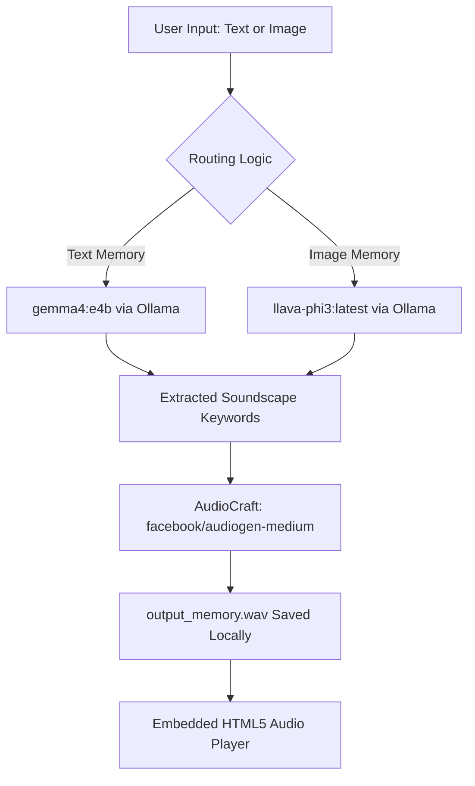

# Acoustic Chronotope ⏳🍃

**Acoustic Chronotope** is a completely local desktop application that transforms visual and textual memory traces into ambient soundscapes. Users can describe a memory fragment in writing or drop a photograph. The system uses a local Multimodal Vision-LLM to identify sensory elements and translates them into ambient audio prompts for a local sound generation model.

---

## 🎨 Design & Layout
The application layout is styled as a **tactile minimalist journal** reminiscent of high-end stationery:
- **Warm Color Palette**: Soft Sand / Linen Cream background (`#FBF9F6`), rich warm-charcoal text (`#2C2A29`), and Terracotta accent states (`#D67B62`).
- **Stationery Canvas Layout**: Stacked card-based input boxes with generous margins, rounded corners (`12px` to `16px`), and soft shadows.
- **Editorial Typography**: Premium serif headers (`Lora` / `Georgia`) paired with clean functional body text (`Inter` / `Helvetica Neue`).
- **Clean Vertical Flow**: Designed with a robust single-column sequence that dynamically displays the Acoustic Canvas and results card only when needed, avoiding complex layout hacks.
- **Dual-Phase Spinner states**: Showcases memory interpretation steps:
  - *Phase 1: "Sensing the memory texture..."*
  - *Phase 2: "Crafting the sound waves..."*

---

## ⚙️ Local System Architecture



---

## 🛠️ Detailed Tech Stack

### 1. The Core Application
* **Python**: The core programming language tying the machine learning models, file operations, and the frontend web framework together.

### 2. Frontend & User Interface
* **Streamlit (`streamlit`)**: The Python-based UI framework used to build the desktop interface.
* **Custom CSS**: Injected into Streamlit to override default styling and achieve the "Warm Minimalist" design (Linen Cream backgrounds, serif typography, rounded corners, custom segmented inputs, and tag styling).
* **HTML5 Web Audio API**: Used natively via Streamlit's `st.audio` component to render the playback bar for the generated sounds.

### 3. Backend Orchestration & Text/Vision AI
* **Ollama Python Client (`ollama`)**: The local server and API library used to route inputs to the Large Language Models without requiring internet access.
* **Gemma 4 (`gemma4:e4b`)**: Google's lightweight 4.5B parameter LLM, used locally to process pure text journals and extract sensory soundscape keywords.
* **LLaVA-Phi3 (`llava-phi3:latest`)**: A 3.8B parameter multimodal vision model (built on Microsoft's Phi-3 architecture), used locally to "see" uploaded images and translate the visual environment into text keywords.

### 4. Audio Generation Engine
* **AudioCraft (`audiocraft`)**: Meta's open-source PyTorch library for deep learning research on audio generation.
* **AudioGen (`facebook/audiogen-medium`)**: A 1.5B parameter autoregressive transformer model accessed via AudioCraft. It takes the text keywords generated by Ollama and synthesizes the ambient environmental `.wav` files (e.g., rain, wind, room tone).

### 5. Deep Learning Frameworks (Dependencies)
* **PyTorch (`torch`)**: The foundational machine learning framework required to run AudioCraft locally. CUDA GPU acceleration is automatically targeted if available.
* **TorchAudio (`torchaudio`)**: Used alongside PyTorch for tensor-based audio manipulation and saving the final `.wav` files.
* **TorchVision (`torchvision`)**: Included as a standard dependency in the PyTorch environment for handling underlying tensor math for multimodal input layers.

---


## 🚀 Setup & Installation

### 1. Prerequisites
- **Python**: Version `3.10` is recommended.
- **CUDA/GPU**: Recommended to ensure rapid AudioCraft generation (CPU fallback is supported but will run slower).
- **Ollama**: Must be installed and running locally on your machine. You **must manually pull** both routing models before launching the application:
  ```bash
  ollama pull gemma4:e4b
  ollama pull llava-phi3:latest
  ```
  *Note: The Ollama python client will not automatically pull these models at runtime. If they are missing, the LLM parsing steps will error out.*

### 2. Dependency Installation
Install the python packages listed in `requirements.txt`:
```bash
pip install -r requirements.txt
```
*Note: If you have version conflicts with pre-installed torch versions, you can install the dependencies without affecting your existing torch setup using:*
```bash
pip install streamlit ollama audiocraft --no-deps
pip install flashy demucs encodec docopt dora-search hydra-core hydra-colorlog julius num2words spacy soundfile einops librosa
```

### 3. Running the Application
Start the Streamlit server from your terminal:
```bash
streamlit run app.py --browser.gatherUsageStats false --server.headless true
```
Once launched, navigate to the local URL:
👉 **[http://localhost:8501](http://localhost:8501)**

---

## ⏳ Model Download & Usage Behavior

### Ollama Routing Models (Manual Setup)
* **gemma4:e4b** and **llava-phi3:latest**: Must be downloaded manually beforehand via the `ollama pull` CLI. Ollama runs entirely offline once these models are cached locally.

### AudioCraft Synthesis Model (Automatic Caching)
* **facebook/audiogen-medium**: When you click **Trigger Memory Spark** for the first time, the AudioCraft library **will automatically download** the 1.5B parameter pre-trained weights (~3GB) from Hugging Face.
* This initial download **requires active internet access** and will take a few minutes depending on your connection.
* Once downloaded, the weights are cached locally. All future sound generation requests will run **100% offline and locally** with no internet access required.

---

## 🛠️ Key Modules Code Structure

- **`app.py`**: Streamlit layout, session state orchestrator, input routing, and action triggers.
- **`styles.py`**: Houses the entire design tokens system: the custom warm CSS stylesheets, header SVGs, vector banner graphics, and custom-styled layout templates.
- **`engine.py`**: Houses the core analytical modules:
  - **`process_memory_spark(text_input, image_path)`**: Determines whether to route visual inputs to `llava-phi3` or text to `gemma4` via the local Ollama API.
  - **`clean_keywords(raw_output)`**: Clean-up parser that strips conversational text, quotes, and list indicators, resolving items into clean comma-separated keywords.
  - **`generate_soundscape(prompt_keywords, duration)`**: Instantiates the local PyTorch pipeline for AudioCraft, runs the inference, and saves the output to `output_memory.wav` (automatically overwriting previous runs).
